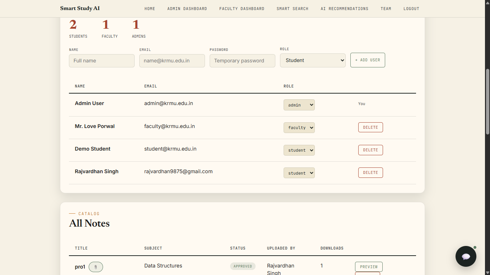
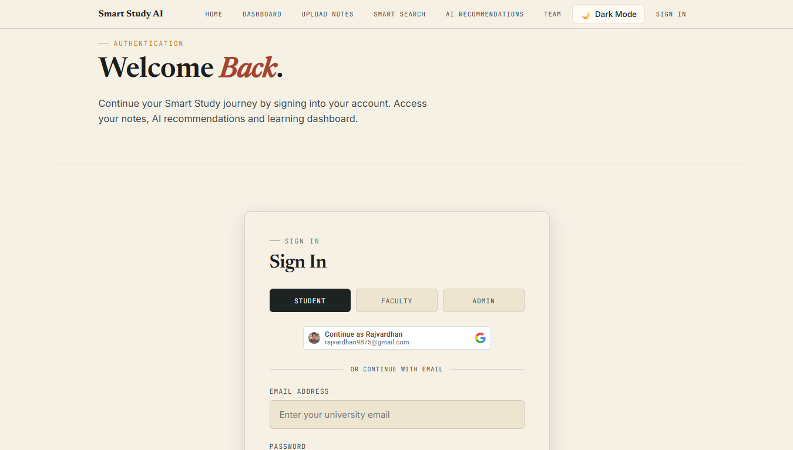
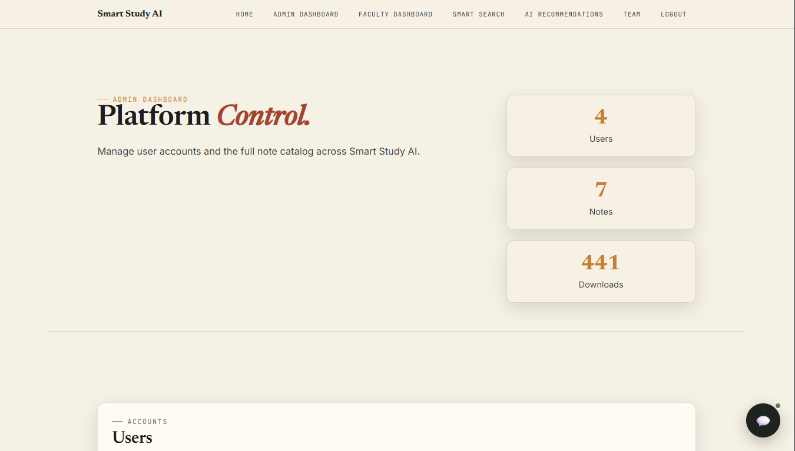
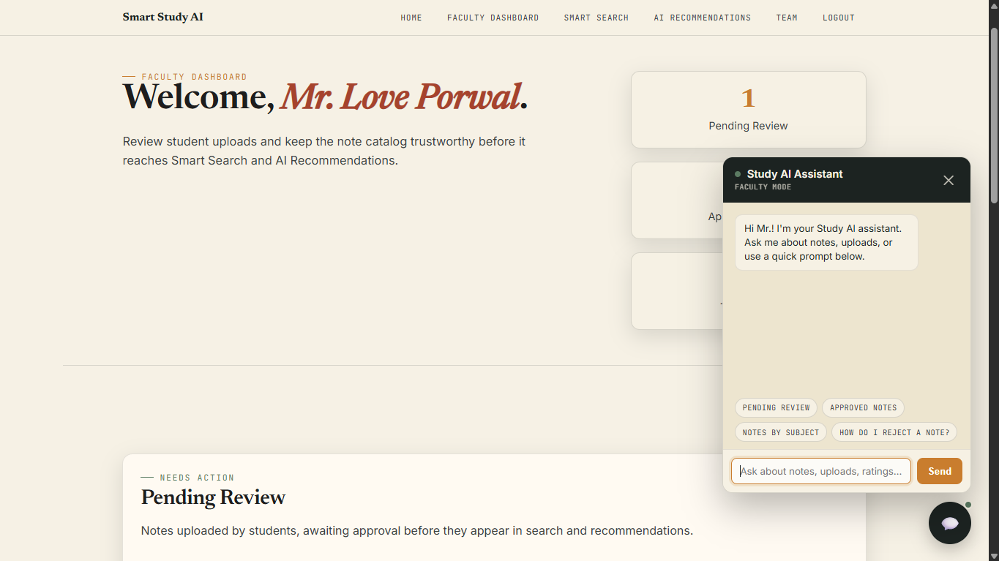
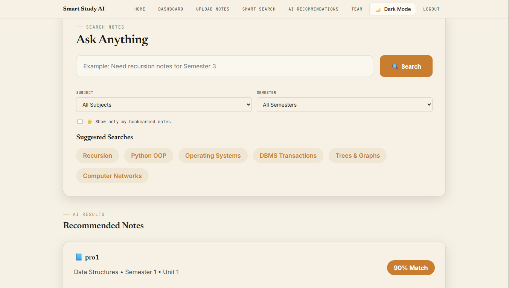
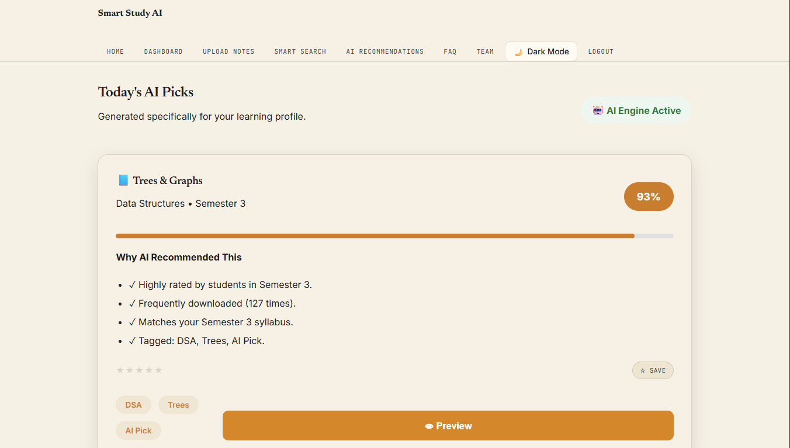
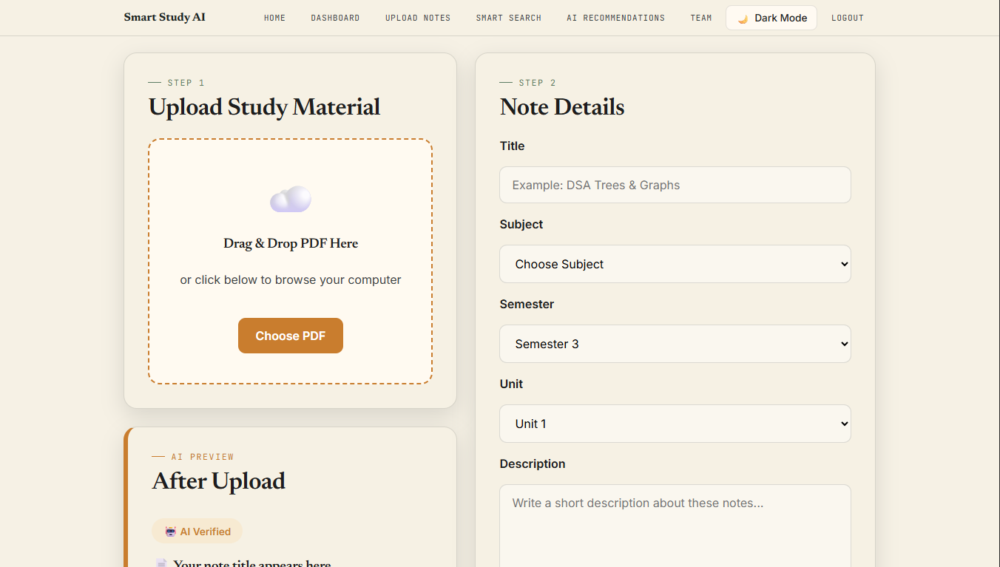
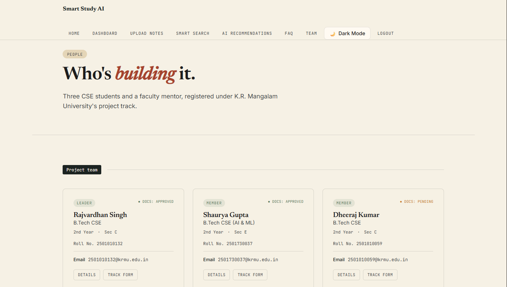

# Smart Study AI (SSAI)

**AI-Based Smart Study Recommendation System** — a notes-sharing platform for students, faculty, and admins, extended with an AI recommendation and semantic search layer. Built as a CSE department project at K.R. Mangalam University.

🔗 **Live demo:** [smartnotesaiii.netlify.app](https://smartnotesaiii.netlify.app/) — frontend on Netlify, backend on a deployed Node host, connected to MongoDB Atlas.

## Screenshots

| Home | Sign In |
|---|---|
|  |  |

| Admin Dashboard | Faculty Dashboard + AI Assistant |
|---|---|
|  |  |

| Smart Search | AI Recommendations |
|---|---|
|  |  |

| Upload Notes | Team |
|---|---|
|  |  |

## Features

- **Role-based access** — separate Student, Faculty, and Admin dashboards
- **Authentication** — JWT sessions, bcrypt-hashed passwords, Google Sign-In, Forgot Password + OTP flow (via EmailJS)
- **Notes workflow** — upload, faculty approval/rejection, subject/semester filters, star ratings, bookmarks
- **AI recommendations** — match-scored note suggestions based on rating average and download volume
- **Keyword-weighted search** — server-side relevance scoring across title, subject, description, and tags
- **Built-in AI assistant widget** — rule-based chatbot on every dashboard, answering notes/upload/rating questions
- **Admin analytics** — user stats, subject breakdown, download/rating analytics
- **PDF storage** — files stay client-side in the browser's IndexedDB; only metadata lives in MongoDB

## Tech Stack

| Layer | Tech |
|---|---|
| Frontend | HTML5, CSS3, vanilla JavaScript — deployed on Netlify |
| Backend | Node.js, Express.js |
| Database | MongoDB with Mongoose |
| Auth | JWT (`jsonwebtoken`), bcrypt |
| File storage | Browser IndexedDB (PDFs never touch the server) |

## Project Structure

```
smart-study-ai/
├── frontend/               # Static site — HTML pages, styles.css, data.js, script.js, chatbot.js
├── backend/
│   ├── server.js           # Express app entry point
│   ├── models/              # Mongoose schemas: User, Note, Otp
│   ├── routes/               # auth, notes, users (+ analytics)
│   ├── middleware/auth.js    # JWT verification + role guards
│   └── .env.example
├── MIGRATION_NOTES.md       # localStorage → Express+MongoDB migration log
├── .gitignore
└── README.md
```

## API Reference

All routes are prefixed `/api`. Protected routes require `Authorization: Bearer <token>`.

| Method | Route | Access | Purpose |
|---|---|---|---|
| POST | `/auth/login` | Public | Log in (auto-creates account if none exists, matching legacy behavior) |
| POST | `/auth/signup` | Public | Register a new account |
| POST | `/auth/google` | Public | Google Sign-In |
| POST | `/auth/request-otp` | Public | Request a password-reset OTP |
| POST | `/auth/verify-otp` | Public | Verify an OTP |
| POST | `/auth/reset-password` | Public | Reset password after OTP verification |
| GET | `/notes` | Auth | List all notes |
| POST | `/notes` | Auth | Upload a note (status starts `pending`) |
| PATCH | `/notes/:id/approve` | Faculty/Admin | Approve or reject a note |
| PATCH | `/notes/:id` | Auth | Update a note |
| DELETE | `/notes/:id` | Auth | Delete a note |
| GET | `/notes/search?q=` | Auth | Keyword search with relevance scoring |
| GET | `/notes/recommendations?limit=` | Auth | AI-scored recommendations |
| POST | `/notes/:id/rate` | Auth | Submit a star rating |
| POST | `/notes/:id/download` | Auth | Record a download |
| POST | `/notes/:id/bookmark` | Auth | Toggle bookmark |
| GET | `/notes/bookmarks` | Auth | List the current user's bookmarked notes |
| GET | `/users` | Admin | List all users |
| POST | `/users` | Admin | Create a user |
| PATCH | `/users/:email/role` | Admin | Change a user's role |
| DELETE | `/users/:email` | Admin | Delete a user |
| PATCH | `/users/me` | Auth | Update own profile / password |
| GET | `/analytics` | Faculty/Admin | Platform-wide analytics |

## Getting Started

### Prerequisites
- Node.js v18+
- A MongoDB instance ([Atlas](https://mongodb.com/atlas) free tier or local)

### Backend setup
```bash
cd backend
npm install
cp .env.example .env   # fill in MONGODB_URI, JWT_SECRET, CORS_ORIGIN
npm start               # or `npm run dev` with nodemon
```
You should see `MongoDB connected` and `SSAI backend running on port 4000`.

### Frontend setup
Open `frontend/index.html` directly, or serve the folder with any static server (e.g. VS Code Live Server). By default it talks to `http://localhost:4000/api` — override this by setting `window.SSAI_API_BASE` in each page's `<head>` before `data.js` loads (already stubbed in, just uncomment and edit).

## Deploying

This project is already deployed:
- **Frontend** → Netlify ([smartnotesaiii.netlify.app](https://smartnotesaiii.netlify.app/))
- **Backend** → Node host, connected to MongoDB Atlas

To redeploy your own copy: point `window.SSAI_API_BASE` (set near the top of each HTML page, right before `data.js` loads) at your backend's `/api` URL, and set `CORS_ORIGIN` on the backend to your frontend's URL.

## Security Notes (fixed during the MongoDB migration)

| Issue (old localStorage version) | Fix |
|---|---|
| Plaintext passwords | bcrypt hash on every save (`models/User.js`) |
| Hardcoded JWT secret | Moved to `.env`, never committed |
| Fully open CORS | Restricted to `CORS_ORIGIN` in `.env` |

See `MIGRATION_NOTES.md` for the full before/after breakdown.

## Team

| Name | Role |
|---|---|
| Rajvardhan Singh | Team Lead |
| Shaurya Gupta | Member |
| Dheeraj Kumar | Member |

**Faculty Mentor:** Mr. Love Porwal, Department of Computer Science & Engineering, K.R. Mangalam University

## License

Academic project — for educational purposes.
